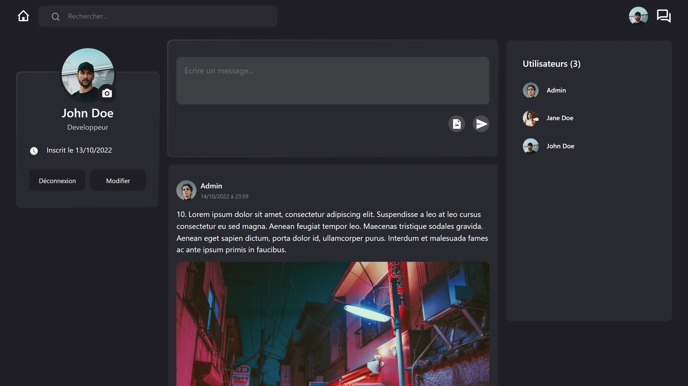

<div align="center">
    <a href="" target="_blank">
      
    </a>
  <h3 align="center">Groupomania Social</h3>
  <h4 align="center">School Project</h4>
</div>

## <br /> 📋 <a name="table">Table of Contents</a>

- ✨ [Introduction](#introduction)
- ⚙️ [Tech Stack](#tech-stack)
- 📝 [Features](#features)
- 🚀 [Quick Start](#quick-start)

## <br /> <a name="introduction">✨ Introduction</a>

**[EN]** A fullstack social media application built with the MERN stack (React, Node.js, Express, MongoDB) as the final project for the Web Developer course at OpenClassrooms. This project involves creating a complete social media platform from scratch, featuring robust CRUD operations for users, posts, and admin accounts. The backend includes enhanced security measures using Helmet, Crypto-js, Bcrypt, and more. It demonstrates comprehensive skills in both frontend and backend development, including user authentication, database management, and dynamic interactions. For more information, see the [docs](/.docs) folder.

**[FR]** Une application de réseau social fullstack construite avec le stack MERN (React, Node.js, Express, MongoDB) dans le cadre du projet final du cours de Développeur Web à OpenClassrooms. Ce projet consiste à créer une plateforme de réseau social complète, avec des opérations CRUD robustes pour les utilisateurs, les publications et les comptes administrateurs. Le backend intègre des mesures de sécurité avancées telles que Helmet, Crypto-js, Bcrypt, et plus encore. Il démontre des compétences complètes en développement frontend et backend, incluant l'authentification des utilisateurs, la gestion de la base de données, et des interactions dynamiques. Pour plus d'informations, consultez le dossier [docs](/.docs).

## <br /> <a name="tech-stack">⚙️ Tech Stack</a>

- [**React**](https://react.dev/reference/react) is a popular JavaScript library for building user interfaces, particularly single-page applications where data changes over time. React's component-based architecture allows developers to create reusable UI components, making development more efficient and the codebase easier to maintain. 

- [**Axios**](https://axios-http.com/docs/intro) is a popular JavaScript library used for making HTTP requests from a web browser or Node.js. It provides a simple and intuitive API for sending asynchronous requests to servers and handling responses. Axios supports features like request and response interception, automatic JSON data transformation, and request cancellation, making it a powerful tool for managing API interactions and handling HTTP communications in web applications.

- [**Mantine UI**](https://mantine.dev/getting-started/) is a modern React component library that provides a set of high-quality, customizable components and hooks for building user interfaces. Mantine UI is designed to be easy to use, with a focus on flexibility and accessibility. It includes components such as buttons, modals, and forms, as well as theming support, responsive design utilities, and built-in hooks for managing state and effects. It aims to streamline the development process and enhance the overall user experience with a consistent and attractive design.

- [**REST API**](https://blog.postman.com/rest-api-examples/) (Representational State Transfer Application Programming Interface) is a specific type of API that adheres to the principles of REST, an architectural style for designing networked applications. REST APIs use standard HTTP methods (GET, POST, PUT, DELETE) to interact with resources, which are typically represented in JSON or XML format. REST APIs are stateless, meaning each request from a client to the server must contain all the information needed to understand and process the request. This approach simplifies the interactions between client and server and ensures scalability and performance.

- [**Node.js**](https://nodejs.org/en/learn/getting-started/introduction-to-nodejs) is a JavaScript runtime built on Chrome's V8 JavaScript engine. It allows developers to execute JavaScript on the server side, enabling the creation of scalable and high-performance applications. Node.js's non-blocking, event-driven architecture makes it particularly suitable for building real-time, data-intensive applications.

- [**Express**](https://expressjs.com/en/starter/installing.html) is a minimal and flexible Node.js web application framework that provides a robust set of features for building web and mobile applications. It simplifies the process of creating RESTful APIs by providing a thin layer of fundamental web application features, including routing, middleware support, and HTTP utilities.

- [**MongoDB**](https://www.mongodb.com/docs/atlas/getting-started/) is a NoSQL database that stores data in flexible, JSON-like documents. It is designed for scalability and high performance, making it suitable for applications that handle large volumes of data. MongoDB's document model allows for easy data manipulation and querying, providing a more natural way to work with data compared to traditional relational databases.

- [**Mongoose**](https://mongoosejs.com/docs/guide.html) is an Object Data Modeling (ODM) library for MongoDB and Node.js. It provides a schema-based solution to model application data, ensuring data consistency and providing powerful tools for querying and validation. Mongoose simplifies the process of interacting with MongoDB by providing a higher abstraction layer.

- [**NPM**](https://nodejs.org/en/learn/getting-started/an-introduction-to-the-npm-package-manager) (Node Package Manager) is the default package manager for Node.js. It allows developers to install, share, and manage dependencies in their projects. NPM provides access to a vast repository of open-source packages, facilitating the rapid development and integration of new features.

- [**Bcrypt**](https://www.npmjs.com/package/bcrypt) is a library for hashing passwords in a secure manner. It uses a salt to protect against rainbow table attacks and employs a computationally intensive hashing algorithm, making brute-force attacks impractical. Bcrypt ensures that passwords are stored securely, enhancing the overall security of an application.

- [**Crypto-js**](https://cryptojs.gitbook.io/docs) is a cryptography library in JavaScript that provides various cryptographic algorithms, such as hashing, encryption, and decryption. It is used to secure data, ensuring its integrity and confidentiality. Crypto-js is commonly used for encrypting sensitive information before storing or transmitting it.

- [**Dotenv**](https://www.npmjs.com/package/dotenv) is a module that loads environment variables from a .env file into process.env. This practice helps manage configuration and secrets in Node.js applications, keeping them out of the source code and making it easier to change settings without modifying the application code.

- [**Helmet**](https://www.npmjs.com/package/helmet) is a middleware for Express applications that helps secure apps by setting various HTTP headers. It mitigates common web vulnerabilities such as cross-site scripting (XSS), clickjacking, and other web attacks by configuring appropriate security-related HTTP headers.

- [**Jsonwebtoken**](https://www.npmjs.com/package/jsonwebtoken) (JWT) is a compact, URL-safe means of representing claims to be transferred between two parties. It is commonly used for authentication and information exchange in web applications, allowing secure and verifiable transfer of information. JWTs are often used for implementing stateless authentication mechanisms.

- [**Mongoose-unique-validator**](https://www.npmjs.com/package/mongoose-unique-validator) is a plugin for Mongoose that adds pre-save validation for unique fields within a Mongoose schema. It simplifies the enforcement of uniqueness constraints in MongoDB documents, ensuring that certain fields, such as usernames or email addresses, remain unique.

- [**Multer**](https://www.npmjs.com/package/multer) is a middleware for handling multipart/form-data, which is primarily used for uploading files. It simplifies the process of handling file uploads in an Express application by providing various options for storage and file handling, making it easy to manage file uploads.

- [**Password-validator**](https://www.npmjs.com/package/password-validator) is a library for validating password strength and compliance with defined rules. It helps enforce security policies by ensuring passwords meet specific criteria, such as length, complexity, and character variety. This enhances the security of user accounts by promoting the use of strong passwords.

- [**Validator**](https://www.npmjs.com/package/validator) is a library for string validation and sanitization. It provides a set of functions for validating and sanitizing strings, helping ensure data integrity and security in web applications. Validator is commonly used for validating user input, ensuring that it meets the expected format and constraints.

## <br/> <a name="features">📝 Features</a>

👉 **Responsive Design**: Ensures the application is fully responsive and optimized for all devices, providing a seamless user experience on desktops, tablets, and mobile phones.

👉 **User Management**: Allows users to create and manage their accounts, including registration, login, and profile updates.

👉 **CRUD Operations for Posts**: Users can create, read, update, and delete posts, including text, images, and other media.

👉 **Admin Functionality**: Provides admin accounts with additional capabilities to manage users, moderate content, and oversee the platform’s overall health.

👉 **RESTful API Development**: The project includes a robust RESTful API built with Node.js and Express. It supports standard HTTP methods (GET, POST, PUT, DELETE) for interacting with resources, enabling seamless CRUD operations.

👉 **Secure Data Storage**: Data is securely stored using MongoDB with Mongoose. Passwords are hashed with Bcrypt, and sensitive information is encrypted using Crypto-js, ensuring data protection and confidentiality.

👉 **Compliance and Data Protection**: The project implements a logical data model that adheres to regulatory standards. Data is validated and sanitized to meet security and compliance requirements.

👉 **Authentication and Authorization**: Secure authentication is handled through Jsonwebtoken (JWT), providing a robust mechanism for verifying user identity and managing access to resources.

👉 **Enhanced Security Measures**: The application uses Helmet to set security-focused HTTP headers, protecting against common web vulnerabilities. File uploads are managed securely with Multer.

👉 **Environment Management**: Configuration and sensitive information are managed using Dotenv, keeping environment variables and secrets out of the source code.

👉 **Unique Data Validation**: Ensures uniqueness of data fields using Mongoose-unique-validator, preventing duplicate entries in the database.

👉 **Comprehensive Error Handling**: Implements thorough error handling and logging mechanisms to track and resolve issues effectively.

👉 **Testing and Validation**: Includes testing processes to ensure the reliability and correctness of the API functionality.

## <br /> <a name="quick-start">🚀 Quick Start</a>

Follow these steps to set up the project locally on your machine.

<br/>**Prerequisites**

Make sure you have the following installed on your machine:

- [Git](https://git-scm.com/)
- [Node.js](https://nodejs.org/en)
- [npm](https://www.npmjs.com/) (Node Package Manager)

Install nodemon globally on your machine, open your terminal and run the following command:
```bash
npm install -g nodemon
```

- **Nodemon** is a tool that helps develop Node.js based applications by automatically restarting the node application when file changes in the directory are detected.

<br/>**Cloning the Repository**

```bash
git clone {git remote URL}
```

<br/>**Installation**

Let's install the project dependencies for both the client and server, from your terminal, run:

```bash
# Navigate to the client directory
cd client

# Install the necessary dependencies for the client-side application
npm install --legacy-peer-deps
# or
yarn install --legacy-peer-deps

# Navigate back to the root directory
cd ..

# Navigate to the server directory
cd api

# Install the necessary dependencies for the server-side application
npm install
# or
yarn install
```

<br/>**Set Up Environment Variables**

1. Create a new file named `.env` inside the client folder and add the following content:

```env
# Must write "REACT_APP" or it won't work
REACT_APP_PUBLIC_FOLDER = http://localhost:5000/images/
```

2. Create a new file named `.env` inside the api folder and add the following content:

```env
PORT=5000

MONGO_URI=

JWT_KEY=

JWT_TIME=24h

CJS_KEY=
```

Replace the placeholder values with your actual respective account credentials:

- [MongoDB](https://cloud.mongodb.com)

<br/>**Running the Project**

Installation will take a minute or two, but once that's done, you should be able to run the following command:

```bash
# Navigate to the client directory
cd client

# Start client
npm start
# or
yarn start

# Navigate back to the root directory
cd ..

# Navigate to the server directory
cd api

# Start server
npm start
# or
yarn start
```

- Client running on [`http://localhost:3000`](http://localhost:4200)
- Server running on [`http://localhost:5000`](http://localhost:3000)

<br/>**Testing**
- User : admin@mail.com
- Password : adminadmin1